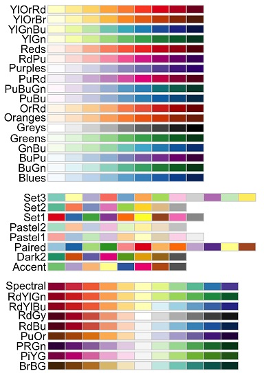

# Illustrator swatches for data visualisation
Popular colour palettes for use in Adobe Illustrator, see [here](https://helpx.adobe.com/illustrator/using/using-creating-swatches.html#use_swatch_libraries) for help on how to import swatches.

## [colorbrewer](http://colorbrewer2.org):

## [matplotlib](https://matplotlib.org/3.1.1/tutorials/colors/colormaps.html):

